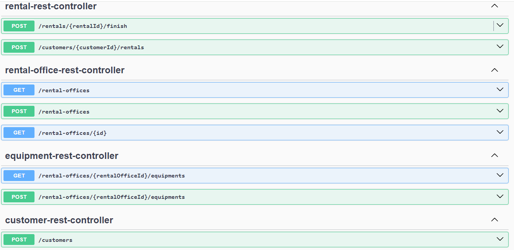

Wyypożyczalnia sprzętów zimowych by Maja Bojdys

Aplikacja umożliwia:
- dodawanie wypożyczalni
- dodawanie sprzętu, który można wypożyczyć
- wypożyczenie sprzętu
- zwrot sprzętu
- informację, ile klient powinien zapłacić za wypożyczenie w PLN oraz w EUR

REST API serwisu można zobaczyć poprzez Swagger pod ścieżką /swagger

API łączy się z NBP API w celu pobierania aktualnego kursu euro

Wykorzystane technologie w projekcie:
- spring web
- spring data
- hibernate
- junit, mockito
- wbudowana baza danych H2
- maven

